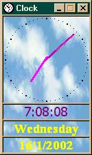



## Timed Shutdown Clock v6\.4

### Description

This program will shut down the computer at a predefined time

or after a specified amount of idle time. I have been about 3 years working

this project so far and it is approximatly 8,500 lines long. The program is

freeware, but I don't have it on a download server yet. It is fully

customizable, from background settings, to snapping the window to the side

of the screen (like winamp). You might need to compile the ocx (code also in

the zip file) - it's a progress bar, but if you have any problems, please

email me. This is kind of a beta test, as I need feedback from people with

me/2000/xp systems to tell me how well it runs. Please report any bugs also,

as I can't fix something I don't know is there :) Any votes are, of course,

appreciated :D
 
### More Info
 

             |
---                |---
**Submitted On**   |2002-01-15 17:09:36
**By**             |[Eric O'Sullivan](https://github.com/Planet-Source-Code/PSCIndex/blob/master/ByAuthor/eric-o-sullivan.md)
**Level**          |Advanced
**User Rating**    |5.0 (10 globes from 2 users)
**Compatibility**  |VB 6\.0
**Category**       |[Complete Applications](https://github.com/Planet-Source-Code/PSCIndex/blob/master/ByCategory/complete-applications__1-27.md)
**World**          |[Visual Basic](https://github.com/Planet-Source-Code/PSCIndex/blob/master/ByWorld/visual-basic.md)
**Archive File**   |[Timed\_Shud497001182002\.zip](https://github.com/Planet-Source-Code/eric-o-sullivan-timed-shutdown-clock-v6-4__1-30943/archive/master.zip)

